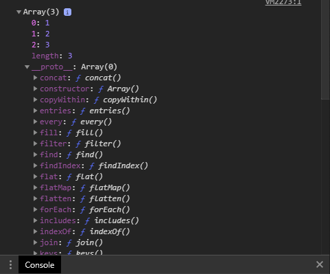

## Prototypal Inheritance

In JavaScript, inheritance or extending is when an object is _based on another object_. If we have a constructor function, for example, that builds an airplane,that constructor - let's say: plane() - can create different models of airplanes and also will be secret linked to a common object called **prototype**.

We can add methods - as well as properties - to the prototype that all objects can share instead of creating the same method every time, for each time a new object is created. This way, every time we need to change the method for those objects, we can simply chance once and it will be applied for all. This also save memory, and keeps the code more clean.

The prototype is an object where the objects created by a constructor function keep a reference to it.

**Example**

```JavaScript
function Course(name) {
    this.subject = subject;
}

Course.prototype.describe = function() {
    console.log(`This is a study about ${this.subject}`);
}

var course = new Course('Prototypal Inheritance');

course.describe();
// This is a study about Prototypal Inheritance
```

The prototype is secretly linked to the function scope. What means that if the method that we want to call for a giver function is not define inside of it, JavaScript keeps looking up in the scope chain until find it. Is like the prototype where a "parent", and when the javacript engine doesn't find it, it continues to look in the scope chain.

### Replacing the prototype object

If we replace the prototype properties, the references of future objects created will chance, and they won't be abl to access the older prototype. Let's see how it works

First, we instantiate our object, and then, we define a method in its prototype, linked to it.

```JavaScript
function Dog() {
    this.color = 'Black';
}

Dog.prototype.sleep = function () {
    console.log('ZzZzZzZz');
}

var iceCream = new Dog();

iceCream.sleep();

// ZzZzZzZz
```

After that, we replace its prototype object properties

```javaScript
Dog.prototype = {
    hasFur: false,
    favoriteFood: 'apples'
};
```

Then we try to access those new properties of the `Dog()` prototype for my old object.

```JavaScript
console.log(iceCream.hasFur);
// undefined

console.log(iceCream.favoriteFood);
// undefined

iceCream.color;
// Black

iceCream.sleep();
// ZzZzZzZz
```

As we see, the `iceCream` object created before the new prototype don't have access to it, and just retains the link to the old prototype

```JavaScript
var donut = new Dog();

console.log(donut.color);
// Uncaught TypeError: Cannot read property 'color' of undefined
donut.sleep();

// Uncaught TypeError: Cannot read property 'sleep' of undefined
```

Same happens to the new object created that can't access the properties of the old prototype. Both objects can access properties form the constructor function that create them, but not properties from the prototype that was created after.

Let's see another example

```JavaScript
var myArray = [1, 2, 3];

myArray.join();
// "123"
```

If we expand, it's possible to see all the properties of the prototype that we frequently use.



It happens that, our array object can't directly access those properties. It goes up through the prototype chain, and grap the method that it needs.

### hasOwnProperty()

This method is used to find a particular property of an object that isn't in the object in question. Upon passing a string of the property name we're looking for, the object return a boolean value indicating whether or not the property belongs to that object.

```JavaScript
function Phone() {
    this.operatingSystem = 'Android';
}

Phone.prototype.screenSize = 6;

var myPhone = new Phone();

myPhone.hasOwnProperty('operatingSystem');
// true

myPhone.hasOwnProperty('screenSize');
// false
```

### isPrototypeOF()

This methods checks if an object is prototype of another object (i.e. if an object exists in another object's prototype chain).

```JavaScript
var tree = {
    hasLeafs: true,
    leafColor: green
};

function AppleTree() {
    this.leafColor = green;
}

AppleTree.prototype = tree;

var myTree = new AppleTree();

tree.isPrototypeOf(myTree);
// true
```

### Object.getPrototypeOf()

We can get properties of an object to check to what prototype it belongs.

```JavaScript
Object.getPrototypeOf(myTree);

// {hasLeafs: true, leafColor: "green"}
```

💡 if we use the object literal notation instead a constructor function to build an object, the constructor is the built-in `Object()` constructor (i.e. the native code).

### Subclasses

As we stabilished inheritance, we can have subclasses, that is, have a 'child' object that takes on or almost 'parent' properties, while retain unique properties of its own.

Let's see how it works by, first, creating a new object

```JavaScript
var bear = {
    claws: true,
    diet: 'carnivore'
};
```

Now, we set a constructor function and, right away, we assign `bear` to it.

```JavaScript
function PolarBear() {
    // ...
}

PolarBear.prototype = bear;

// {claws: true, diet: "carnivore"}
```

Above, the constructor `PolarBear()` inherited the properties of `bear`. After that, we create a new object out of `PolarBear()` constructor function.

```JavaScript
var snowball = new polarBear();

snowball.color = 'white';
snowball.favoriteDrink = 'cola';
```

The object snowball, now, has the `color` and `favoriteDrink` attributes of its own and also the two attributes `claws` and `diet` that was inherited from its "parent" prototype. This is possible because `snowball` are linked to the `PolarBear()` constructor, and the PolarBear() constructor are linked to the `bear` object. So, the `bear` object defines the `PolarBear()` constructor.

We can verify if snowball is, indeed, linked to the bear prototype:

```JavaScript
snowball.__proto__;
// {claws: true, diet: "carnivore"}

bear.isPrototypeOf(snowball);

//true
```

As we see, the link that connects the object snowball, is the `__proto__` property. And we can also verify using the `isPrototypeOf` method.

⚠ **It is highly discouraged to reassign the __proto__ property, or even use it in any code you write, and it should not be used to manage inheritance**

### Object.create()

The `Object.create()` method creates a new object, using an existing object as the prototype for the newly created.

**Syntax**

`Object.create(proto, [propertiesObject])`

Where _propertiesObject_ is the arguments that we want to pass to our object.

```JavaScript
var person = {
    hairColor: 'black'
    introduce: function() {
        console.log(`I am ${this.name}. I have ${this.hairColor} hair.`)
    }
};

var me = Object.create(person);

me.name = 'Rafael';

me.introduce();
// I am Rafael. I have black hair.
```

___

### Further research