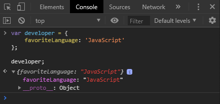
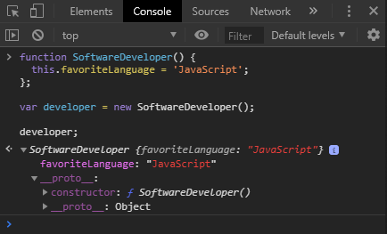

## Constructor Functions 🏗

Constructor functions are the foundation of object-oriented in JavaScript. They can be created as a normal function, with a couple of excepions:

* How the function is coded internally, using `this` keyword.
* The use of the `new` operator.

The function must be created using the following **structure** and **syntax**:

```JavaScript
function SoftwareDeveloper() {
  this.favoriteLanguage = 'JavaScript';
}

let developer = new SoftwareDeveloper();

// SoftwareDeveloper { favoriteLanguage: "JavaScript" }
```

Observing the example above, we may notice the `this` keyword right before the object's name, instead of just write the key property and assign a value to it as we do using the object notation. It is used when we create an object with the _constructor function_. This way we can also create an key property related to the object, passing the value right after. Then, we use the `new` operator to create the object that we defined as a function. The created function will add a `favoriteLanguage` property to any object that it creates, and assigns it a default value of `'JavaScript'`.

The `new` operator invokes the function `SoftwareDeveloper()` creating a _new object_, and assign it to the variable `developer` that.

The created function doesn't return any value, because constructor functions in JavaScript should not have an explicit value. That's why we build the object with the `new` operator and assign the value of the created object to the variable `developer`.

💡 _Although it is not enforced by the language, its a good practice using **camel case** to start constructor functions names, with capitalized letters._

### Differences between an object notation and constructor function.



With Object notation, the object is created with the native code constructor.




And with the constructor object we have a _constructor_ - of course! -, with the name of the function that we defined (i.e. `SoftwareDeveloper()`).

### Creating multiple objects.

Invoking the same constructor function `SoftwareDeveloper()`, we can create other objects:

```JavaSCript
var pilot = new SoftwareDeveloper();
console.log(pilot);

// SoftwareDeveloper { favoriteLanguage: 'JavaScript' }
```
`pilot` is now an object with all the attributes of `SoftwareDeveloper()`.

### Passing arguments to parameters

**Ex. 1**
```JavaScript
function SoftwareDeveloper(name) {
  this.favoriteLanguage = 'JavaScript';
  this.name = name;
}

var student = new SoftwareDeveloper('Rafael');

console.log(student);
```

The `name` parameter will receive any argument that is passed to it, and then will create an object with the values that was passed.

**Ex. 2**

```JavaSCript
function Book(gender, numberOfPages) {
    this.gender = gender;
    this.numberOfPages = numberOfPages;
    this.describe = function() {
        console.log(`This is a ${this.gender} book, and have ${this.numberOfPages} pages.`);
    }
};

let science = new Book('science', 531);
science.describe();
// This is a science book, and have 531 pages.

let fiction = new Book('fiction', 719);
fiction.describe();
// This is a fiction book, and have 719 pages.
```

⚠ It's important to remember of `this` keyword when we want to retrieve the variable name, because `this` _hold the data_ that points to a specific variable in the scope of the function we're working on. If, by any chances,there is a variable with the same name, it may cause some future problems if we don't use.

Also note, that if we omit the `new` operator, an undefined value will be assigned to the variable, and nothing is returned.

```JavaScript
function Student(name, lesson) {
    this.name = name;
    this.lesson = lesson;
    this.study = function(){
        console.log(`${name} is studying ${lesson} today.`);
    }
};

var student = Student();
// undefined
```

Why? Well, science we don't use the `new` operator (which is the "command" to create an object), all we do is simply make a regular function call and no object is created. As by default, constructor functions doesn't return any statement, when the function is invoked, it returns _undefined_.

### instanceof

We use the `instanceof` operator if we want to see if an object was created with a constructor function, in the first place. The result is a boolean value.

```JavaScript
function Beverage(name) {
    this.name = name;
}

var typeOfBeverage = new Beverage('Coffee');

typeOfBeverage instanceof Beverage;
// true
```

First we passed the _name of the object_, followed by the _operator_ `instanceof` and lastly, the name of the _constructor function_. And we can see that the object `typeOfBeverage` was, indeed, created with a constructor function.

### Summary

A **constructor function** is a function that provides attributes, values and methods to an object that we want to create. Then, variable must be created to be our object, by assigning the object built from the constructor.

To create the object, we use the `new` operator before the constructor function name, and after the name we use `()` to invoke and build the object with all the keys and method passed.

___

### Further research

* [The new operator](https://developer.mozilla.org/en-US/docs/Web/JavaScript/Reference/Operators/new) on MDN
* [instanceof operator](https://developer.mozilla.org/en-US/docs/Web/JavaScript/Reference/Operators/instanceof) on MDN