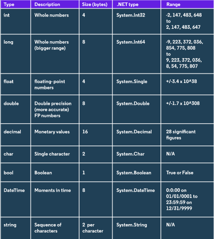

### Getting input

It's possible to read input from a user, with the command `Console.ReadLine()`, wich captures the text that user types into the console.

Let's see how it works:

```C#
Console.WriteLine("How old are you?");
string input = Console.ReadLine();
Console.WriteLine($"You are {input} years old!");
```

We created a _string_ variable called `input`, and assigned to it the command to read a value from the keyboard.

⚠ The standard input method is _string_. We'll have an error if another value type is assigned.

### Data Types and Variables

when writing programs, we need to tell the computer how to process pieces of information, like number or texts. This is extremely important because they need to know how to manage that data. without this definition, we would end up getting bugs.

Data types tell us _how data can be stored, what operations we can perform with it and different methods it can be used with_.

C# is _strongly-typed_ and _statically-typed_, checking if we used the correct type before the program runs. This is important because help to write scalable code with fewer bugs. It means more code, but has long term benefits like built-in documentation and increased readability.

**Some of data types in C#**




### Converting data Types

There are some circumstances where we want to change the type of a variable. Because of that, there are a couple of different ways to do the conversion:

* _implicit_ conversion: It happens automatically, if no data will be lost in the conversion. That’s why it’s possible to convert an int (which can hold less data) to a double (which can hold more), but not the other way around.

* _explicit_ conversion: requires a **cast** operator to convert a data type into another one. So if we do want to convert a double to an int, we could use the operator `(int)`.

```C#
double myDouble = 1.234;
int myInt = (int)myDouble;

// 1
```

The same conversion could be written as:

```C#
double myDouble = 1.234;
int myInt = Convert.ToInt32(myDouble);

// 1
```

We can directly convert the input into a int type, passing the int value right into `myAge`:

```C#
Console.Write("Enter your age: ");
int myAge = Convert.ToInt32(Console.ReadLine());
Console.WriteLine($"You are {myAge} years old.");
Console.ReadLine();
```

### Working with numbers

No matter wat we want to do, we'll always need numbers. In art, game, business...

#### Double and decimal

If we want to use decimal values, we have a few options like: float, double and decimal. Double, is usually the best choice because it is more precise than float, and faster than decimal. But if we want to perform financials operations, we would choose **decimal** rather than double, since it is the **most precise**.

Double

```C#
double number = 23.586988;
```

Decimal

```C#
decimal number = 235689.73m;
```

⚠ It's important to remember the `m` at the end of the number. It tells the C# that we're defining a decimal value.

### Built-in Methods

Using some methods

```C#
int numberOne = 12932;
int numberTwo = -2828472;
            
double numberOneSqrt = Math.Floor(Math.Sqrt(numberOne));
double numberTwoSqrt = Math.Floor(Math.Sqrt(Math.Abs(numberTwo)));
Console.WriteLine(Math.Min(numberOneSqrt, numberTwoSqr));
Console.ReadLine();
```

### Substrings

The substring method is useful when we want to grab a part of a string,using a specific character and, return the rest of the string right after that position. It basically returns a new string starting from that point we asked to.

Is useful when we want to use part of a string, but keep the original data intact.

```C#
string southernCountries = "Brazil, Argentina, Chile, Peru";
int charPosition = southernCountries.IndexOf("Argentina");
string speakSpanish = southernCountries.Substring(charPosition);

Console.WriteLine(speakSpanish);

// Argentina, Chile, Peru

Console.WriteLine(southernCountries);

// Brazil, Argentina, Chile, Peru
```

We still have the original string variable `southernCountries`.

### Bracket Notation

Used to identify a particular character in a given position, without return the rest of the string after that value.

```C#
string southernCountries = "Brazil, Argentina, Chile, Peru";
int charPosition = southernCountries.IndexOf("A");
char speakSpanish = southernCountries[charPosition];
```

⚠ Note that this method is case sensitive and returns the first character that comes in the string.

It's also possible to combine both methods to dry our code and make it more simple:

```C#
string name = "Rafael Lima";
char firstLetter = name[name.IndexOf("R")];
string lastName = name.Substring(name.IndexOf("L"));
Console.WriteLine($"{firstLetter}. {lastName}");
Console.Read();

// R. Lima
```

Besides that, we still have many other method to manipulate strings, such as `ToUpper()` and `ToLower()`.

### Switch

```C#
Console.Write("Pick a genre: ");
    string genre = Console.ReadLine();

    switch (genre)

    {
    case "Drama":
        Console.WriteLine("Citizen Kane");
        break;
    case "Comedy":
        Console.WriteLine("Duck Soup");
        break;
    case "Adventure":
        Console.WriteLine("King Kong");
        break;
    case "Horror":
        Console.WriteLine("Psycho");
        break;
    case "Science Fiction":
        Console.WriteLine("2001: A Space Odyssey");
        break;
    default:
        Console.WriteLine("No movie found");
        break;
    }
    Console.ReadLine();
}
```

### Calling methods

As already known, we can define and call our own methods. But we have to call them inside the `Main()`, wich is the main method. If not, our code won't show nothing. Let's take a look on a simple example:

```C#
static void Main(string[] args) // Main method.
    {
      VisitPlanets(3); // Calls the method defined outside of main.
    }
    
    static void VisitPlanets(int numberOfPlanets)
    {
    	  Console.WriteLine($"You visited {numberOfPlanets} planets…");
    }
```

⚠ In C#, we use **PascalCase** to define the names of the methods. It always start with a capital letter.

We also can use an **optional parameter**. They are **default** values wich are passed as arguments if no value is passed by the user. To set a default value, we just assign any value we want by using `=` as we use in a variable.

```C#
static void Main(string[] args) // Main method.
    {
      VisitPlanets(3); // Calls the method defined outside of main.
    }
    
    static void VisitPlanets(int numberOfPlanets = 0)
    {
    	  Console.WriteLine($"You visited {numberOfPlanets} planets…");
    }
```

So, the code above will print `0` if we don't pass any argument to the function's parameter `numberOfPlanets`.

But if the method have lots of parameters, and we just want to specify one of these? It's simple! We use the parameter name followed by `:` as we see bellow.

```C#
static void Main(string[] args)
{
    MyMethod(d: 4);
}

static void MyMethod(a = 0, b = 0, c = 0, d = 0, e = 0)
{
   // {...}
}
```

### Method Overload

Method overload is basically a method that has more than one version (i.e. at least one different parameter type). `The Math.Round()` method is one of them, and can be checked in [Microsoft documentation](https://docs.microsoft.com/en-us/dotnet/api/system.math.round?view=netframework-4.8).

This first method uses `Math.Round(Double, Int32)` and round the double number to `int`'s value decimal points.
```C#
Math.Round(3.14159, 2)

// 3.14
```

The second method `Math.Round(Double)` rounds the double number to the nearest int, wich is 3.

```C#
Math.Round(3.14159)

// 3
```

As we see, Both methods are similar, but the first has a second parameter called `Int32`, and the second just got one called `Double`. those variations are called **Method Overload**.

### Return

We use the `return` statement to return a value from a method/function.
This keyword tells the program to exit the method and return a value to wherever the method was called.

```C#
static string Greet(string phrase) // method defined here
{
    return phrase.ToUpper();
}

static void Main(string[] args)
{
    Console.WriteLine(Greet("Hello!")); // method was called here
}

// HELLO!
```

To define a function, we _have to tell_ what type of data it will return. This type is defined right before the name of the function. In the example above, the type is `string`, before the function `Greet(sting phrase)`. If a method returns a type different from its stated return type, it will throw an error. So, _methods always have to return the same value type as stated._

So, basically the syntax is: `accessModifiers returnType MethodName(parameterType parameterName)`

⚠ A function also can be executed without return any value, in this case we call them _procedures_. We use `void` to return nothing.

### Out

The `out` keyword basically returns an number from a first argument passed as a string to the function:

```C#
int number;
Console.Write("Enter a value: ");
bool success = Int32.TryParse(Console.ReadLine(), out number);
    if (success == true)
    {
        Console.WriteLine($"{number} was successfully converted in a {number.GetType()} type");
        Console.WriteLine(success);
    }
    else
    {
        Console.WriteLine($"\nThe informed value cannot be converted in a Int32 valid type");
        Console.WriteLine(success);
    }

Console.WriteLine("\nPress any key to continue...");
Console.ReadKey(true);
```

The informed value will be parsed and assigned into `number`, and the boolean value into success. If the informed value can't be converted we'll have a value 0 for number and false for success.

